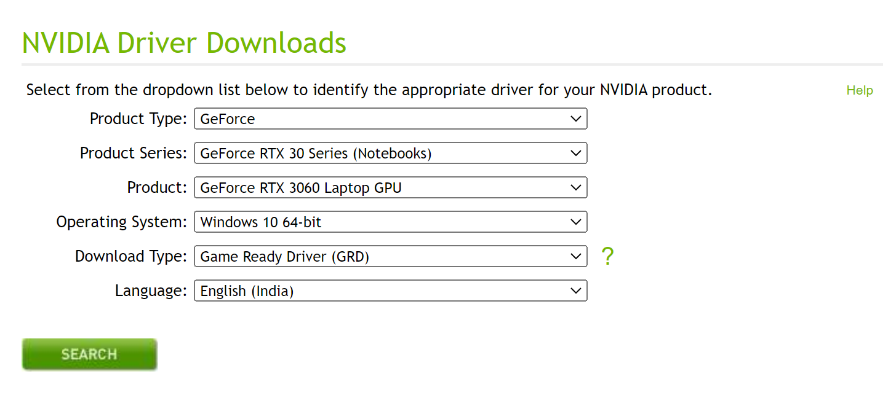

# Nvidia Driver installation

* Generally Nvidia drivers are already present by default. But we need to check its version first. It should be 450.80.02 or higher.
* First check the version of the driver installed in your systems.
    - Go to `start menu`
    - Search for `Nvidia control panel`
    - once the window for Nvidia control panel opens, click on the system information present at the bottom left corner.
    - Here you can see the driver version. If its more than 450.80.02 then only proceed to the next step otherwise you can skip this step.
* Go to official Nvidia driver page from here - [click me](https://www.nvidia.com/drivers) 
* Select the following options as given in the dropdown list as per your device type -
<!-- 
!!!Note "screenshot"
     -->

<figure markdown>

  { width="70%" }
  <figcaption><h3>Nvidia Driver Select</h3></figcaption>
</figure>